# Практическая работа №1
**Тема:** Консольные утилиты настройки сетевых компонентов в ОС Windows (или другой ОС)

**Обучающийся:** Грицкевич Константин Олегович, К3241  
**Преподаватель:** Харитонов Антон Юрьевич  
**ИТМО, 2026**

---

## 1. Проверка сетевых компонентов
Проверка производится в свойства сетевого адаптера, нам нужно убедиться что все необходимые настройки включены.

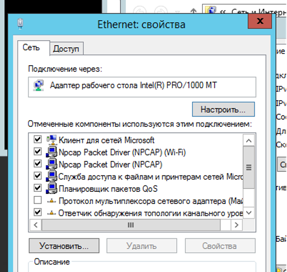
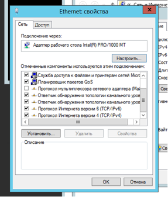
*(скриншот 2 как продолжение, из-за непоместившегося компонента)*

* **Клиент для сетей Microsoft** - позволяет компьютеру получать доступ к ресурсам (файлам и принтерам) других компьютеров в сети Windows.
* **Служба доступа к файлам и принтерам** - позволяет другим пользователям видеть и использовать ресурсы нашего компьютера.
* **Протокол TCP/IPv4** - основной протокол передачи в современных сетях.

### Отключение доступа по SMB
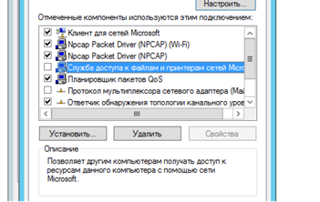
Для защиты от внешнего доступа необходимо снять галочку со «Службы доступа к файлам и принтерам» в свойствах адаптера. Это закроет порты 139 и 445, через которые работает протокол SMB.

## 2. IP-конфигурация
На скриншоте отображен результат команды `ipconfig /all`.

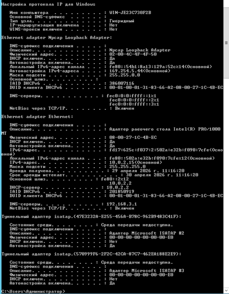

* **IP** - адрес устройства
* **Mask** - сеть
* **Gateway** - выход в интернет
* **DNS** - сервер имён
* **DHCP** - автонастройка

## 3. Команда ping
Команда используется для проверки подключения к определенным ресурсам (обмен пакетов, задержка и т.п.).
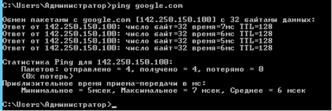
* `ping google.com` - стандартная команда, отправляет 4 пакета по 32 байта каждый.

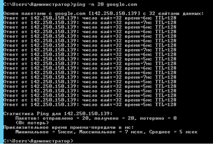
* `ping -n 20 google.com` - количество пакетов.

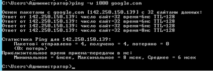
* `ping -w 1000 google.com` - допустимое ожидание ответа.

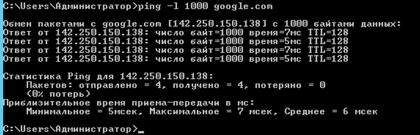
* `ping -l 1000 google.com` - задаем объем пакета в байтах.

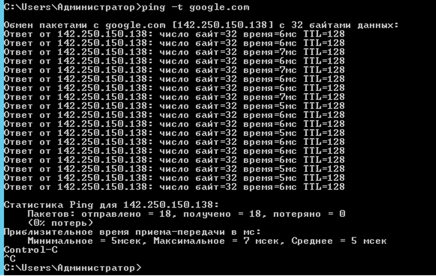
* `ping -t google.com` - будет работать пока не остановить, после завершения отображает статистику.

## 4. Команда tracert
На виртуальной машине весь трафик идет через материнскую машину (хост) и как следствие не видит весь маршрут “хопов”.
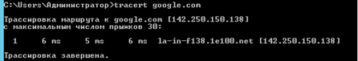
* `tracert google.com` - стандартная команда.

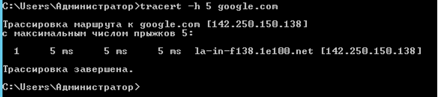
* `tracert -h 5 google.com` - допустимое количество хопов.

**На хосте (не виртуальной машине):**
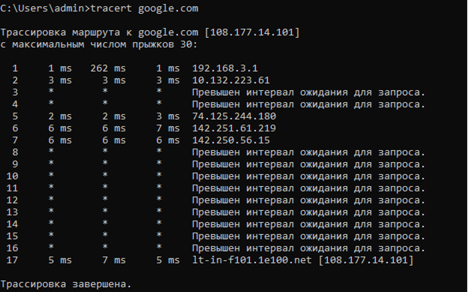
* `tracert google.com` - стандартная команда.

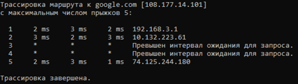
* `tracert -w 2000 google.com` - задаем допустимое время ожидания в мс.

## 5. Команда net

* **net view** - список компьютеров. Выдает ошибку 6118. Пришел к заключению, что команда “выпиливается” службами безопасности.

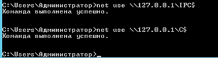
* **net use** - подключение дисков. Проверка подключения через `IPC$` и `C$`.

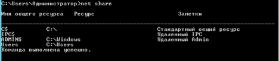
* **net share** - расшаренные ресурсы. Сервер SMB активен.

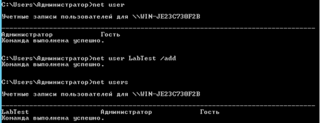
* **net user** - управление пользователями (добавление `LabTest /add`).

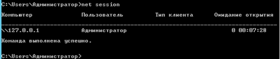
* **net session** - активные подключения к самому себе (127.0.0.1).

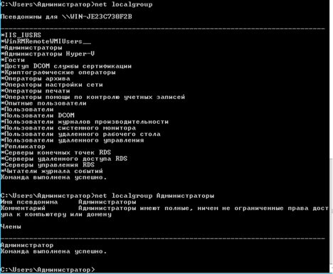
* **net localgroup** - группы (Администраторы).

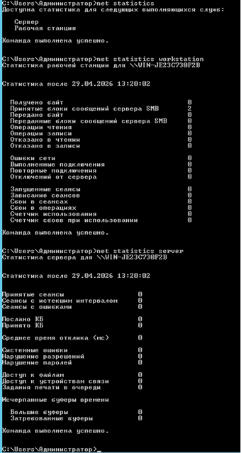
* **net statistics** - отображение статистики `workstation` и `server`.

## 6. DNS
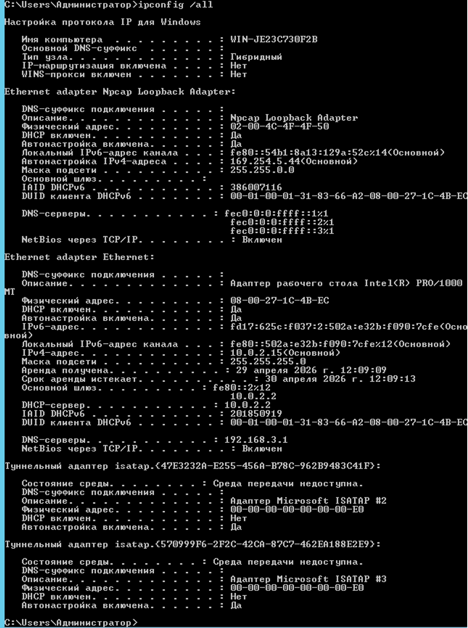
* **DNS-серверы** отвечает за доменную базу - связь доменов и ip адресов серверов. Сервер 8.8.8.8 принадлежит Google.
* **Основной DNS-суффикс** указывает на принадлежность к конкретному домену.
* **DNS-суффикс подключения** - домен провайдера или роутера.

## 7. Скрипты автоматизации

### Скрипт Bash (.bat)
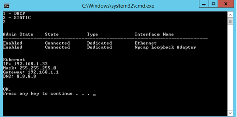
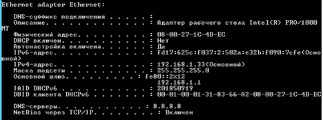
### Скрипт Powershell (.ps1)
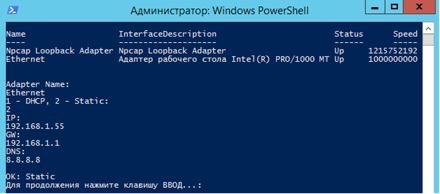
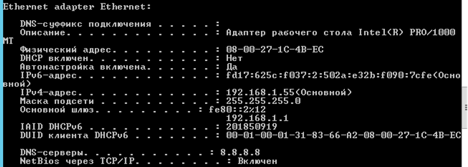
**Использование DHCP:**
После возврата в автоматическое назначение изменились параметры IPv4, шлюз и DNS.
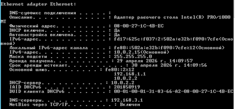

---

## Ответы на вопросы

1. **Как запретить доступ к ресурсам своего ПК и к чужим?**
   * К себе - снять галочку со «Службы доступа к файлам и принтерам».
   * К другим - снять галочку с «Клиент для сетей Microsoft».

2. **Назначение команды net:**
   * `use` - подключение дисков.
   * `view` - список компов.
   * `stop/start` - управление службами.
   * `share` - создание общих папок.
   * `user` - пользователи.
   * `statistics` - статистика.
   * `localgroup` - группы.

3. **Как узнать DNS через консоль?**
   `ipconfig /all` или `Get-DnsClientServerAddress` в PowerShell.

4. **Зачем нужна net use и пример для диска R?**
   Нужна для маппинга сетевых папок. Пример: `net use R: \\SRV\TEST`.

5. **Как переименовать соединение в PowerShell?**
   `Rename-NetAdapter -Name "OldName" -NewName "NewName"`.

6. **Режимы работы (duplex)?**
   * **Full-duplex** - одновременная передача и прием.
   * **Half-duplex** - поочередная передача и прием (как рация).